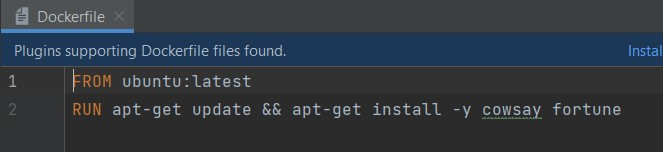
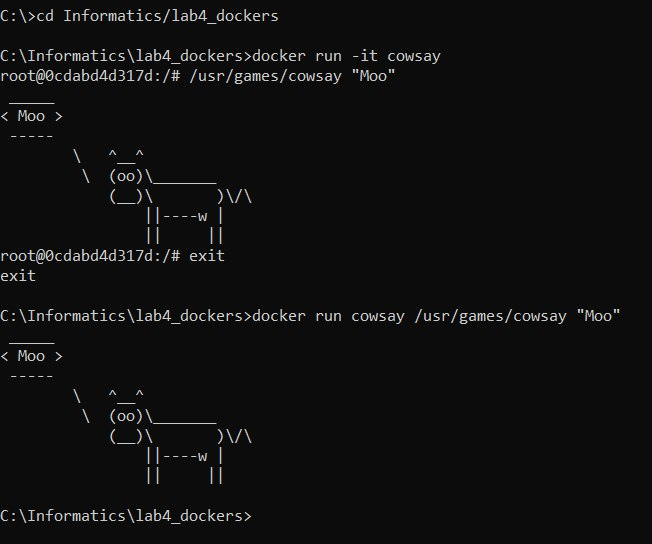
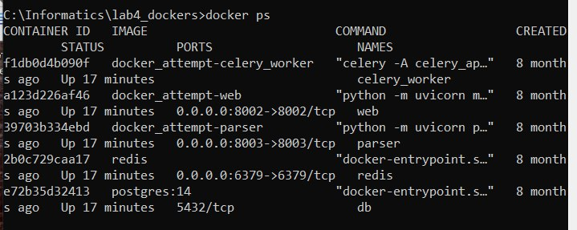
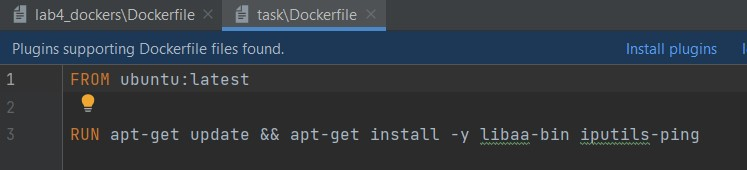
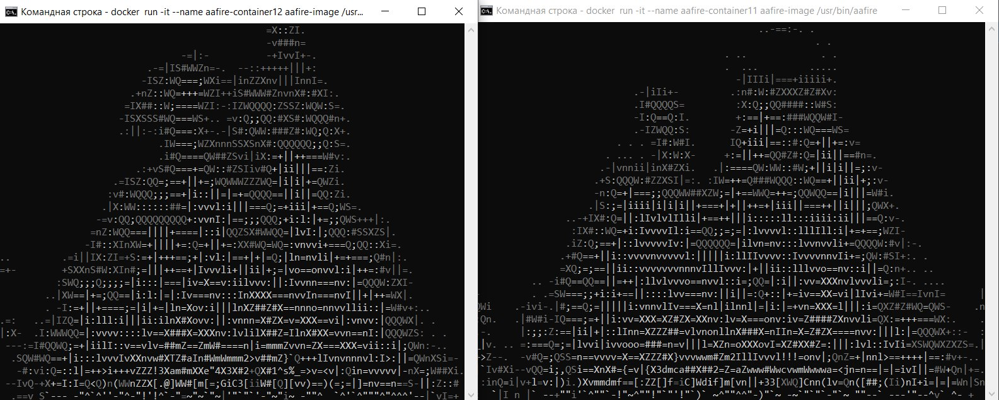
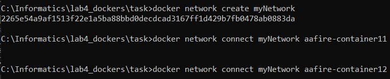
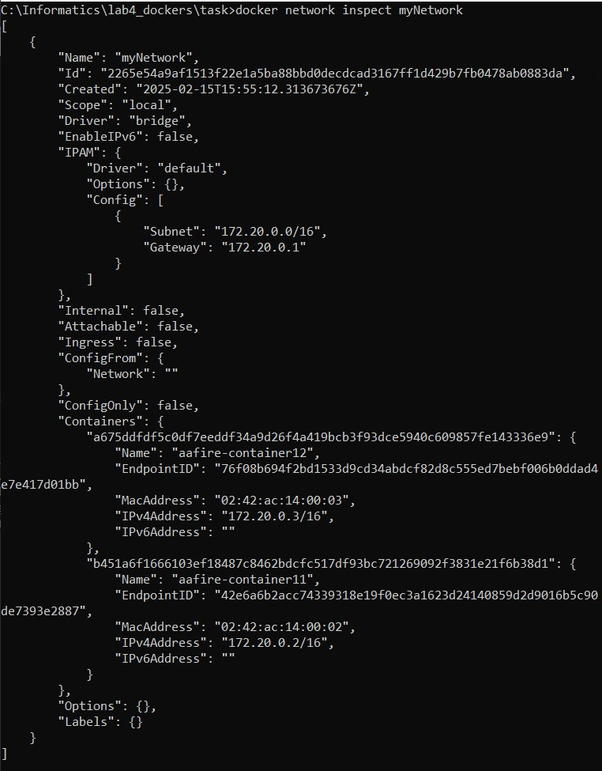
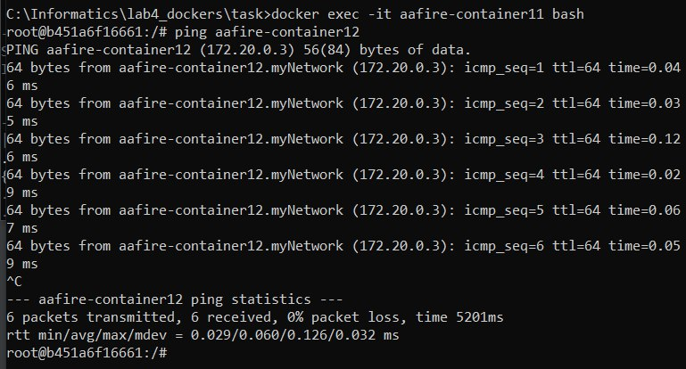
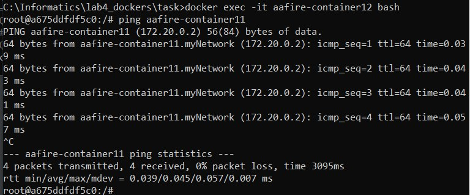

# Лабораторная работа 4: Работа с Docker

---

## Подготовка
Docker уже был установлен, так что сразу приступила к выполнению заданий

## Создание Docker-образа и запуск контейнера (cowsay)

### 1. Создание Dockerfile
Был создан Dockerfile:



Этот Dockerfile создает образ на основе Ubuntu, обновляет пакетный менеджер и устанавливает пакеты cowsay и fortune.

### 2. Сборка Docker-образа и запуск контейнера
Был собран Docker-образ с тегом `cowsay`:

```bash
docker build -t cowsay .
```
Затем был запущен контейнер
На приложенном скриншоте представлены оба варианта:




### 5. Проверка запущенных контейнеров
Для проверки запущенных контейнеров была выполнена команда docker ps:



---

## Задание: Запуск приложения aafire

### 1. Создание Dockerfile для aafire
Был создан новый Dockerfile для установки aafire и ping:



### 2. Сборка образа
Был собран Docker-образ с тегом aafire-image:

```bash
docker build -t aafire-image .
```

Далее были запущены два контейнера:



---

## Настройка сети между контейнерами

Оба контейнера находятся в работающем состоянии

Была создана сеть:
```bash
docker network create myNetwork
```
Оба контейнера подключились к сети:


Проверка настройки сети:



###  Проверка соединения между контейнерами
Подключение первого контейнера и пинг второго:

Подключение второго контейнера и пинг первого:


Связь настроена

---

## Заключение
В ходе лабораторной работы был получен опыт работы с Docker-образами и контейнерами, а также навыки настройки сети между двумя контейнерами.
